机器学习纳米学位-猫狗大战

[TOC]

## 毕业项目
张新洲 优达学城 

2019年09月19日


## I. 问题的定义

### 项目概述

猫狗大战项目（dogs vs cats）主要是解决计算机识别猫和狗的问题。给定了一个中等规模的数据集，数据中通过文件名标定了猫和狗的标签，同时包含了一些干扰和异常数据，要求开发一个模型或者识别程序，能够从数据集中学习，而后对测试数据进行区分，最终以模型在测试数据上的识别准确率来衡量模型性能。

项目来自于kaggle比赛，相关数据集下载自kaggle。该项目本质是一个图片二分类问题，多年以来，传统的编程方法对于图片分类一直没有好的方法；近年来，随着计算机的飞速发展，深度学习的方法大放异彩，在计算机视觉领域取得了飞速进展，利用多层神经网络学习一定的数据量后，模型可具备较高的性能，在某些应用领域甚至超越了人类。

本项目利用pytorch机器学习框架，搭建一个深度学习网络模型，利用kaggle比赛《Dogs vs. Cats Redux: Kernels Edition》中的数据集对模型进行训练、优化，利用优化后的模型对未曾见过的猫狗图片（test数据集）进行分类。

### 问题陈述
该项目本质是一个图像分类问题。采用深度学习的方法，构建一个多层的神经网络模型，通过训练数据的学习，使得模型能够区分猫和狗的特征，进而识别猫和狗。图像处理和特征提取，不可避免要用到卷积神经网络CNN，借鉴成熟的VGG、Inception、Resnet等著名的神经网络构建技巧，构建一个卷积神经网络，不断调整其参数，通过多代次的训练，最后达到项目要求。

### 评价指标

#### 平均交叉熵:

平均交叉熵为机器学习所使用的损失函数

模型在测试数据集样本上的归属概率输出与真实数据样本归属的差异程度。平均交叉熵越小，模型性能越好。计算公式如下所示：
$$
LogLoss = -\frac{1}{n}\sum_{i=1}^{n}[y_{i}*log(\widehat{y}_{i})+(1-y_{i})log(\widehat{y}_{i})]
$$
其中:

- $n$是测试集中的图像数
- $\widehat{y}_{i}$是图像是狗的预测概率
- $y^i $图像是狗，则为1，如果是猫则为0
- $log()$ 是自然（基数e）对数

当logloss较小时，模型表现能力强，正确预测猫狗图片的能力强；当logloss较大时，模型表现能力差，正确预测猫狗图片的能力弱。

模型的优化方向即是使交叉熵输出最小,简单的说优化模型就是尽力找到交叉熵最小值。

### 数据的探索
数据是kaggle比赛提供的，从kaggle网站上下载资源包dogs-vs-cats-redux-kernels-edition.zip，解压可以得到一个sample_submission.csv和两个压缩包train和test，将这个两个压缩包继续解压到对应的文件夹中。train文件夹中就是训练模型所需要的数据集，test文件夹就是待机器学习模型预测分类的图片。其中sample_submission.csv提供了图片预测的格式。ID是test文件夹中图片的名称，label就是我们预测的结果（如果是猫填0，狗填1）。比如test文件夹中图片1模型预测为狗，那么就是id=1，label=1。train文件夹是训练模型的数据集，这里面图片的格式是动物种类+编号+jpg（如cat.0.jpg），所以图片的第一个名称就是标注，kaggle已经提前标注好了图片。

猫狗大战项目的数据集主要就是猫和狗的图片，训练集中有猫和狗各12500张，共计25000张图片。待预测的test文件夹中有12500张猫和狗的未分类图片，待使用训练好的分类模型进行预测。以下是部分图片展示。

图1
图2
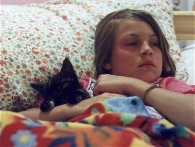图3
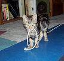图4
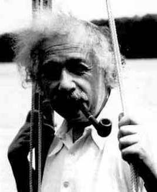图5

这些图片大部分都都像图1那样，标注正确、大小合适、清晰、没有包含其他元素。但也有一部分异常的数据，图片模糊（如图2），包含了其他的元素（图3），尺寸太小（图4），标注或者说分类错误（如图5，爱因斯坦被分类为dog，显然是错误的）。

考虑到这个机器学习分类模型的意义就是能像人一样，能够把一张输入的图片正确的分类是猫还是狗，既然人能狗正常的识别，模糊，包含多个物体，尺寸很小的图片，那么机器学习也要能够正确识别这些图片，因此这些图片可以保留可以作为训练的样本，但是图5这种分类错误的图片不允许出现，这会影响到模型的训练，需要剔除分类错误的图片。

至于尺寸大小不一，可以对这些图片做归一化处理，简单的说就是把图片的尺寸都调整为224*224的尺寸，中心化处理和灰度化处理。

### 探索性可视化

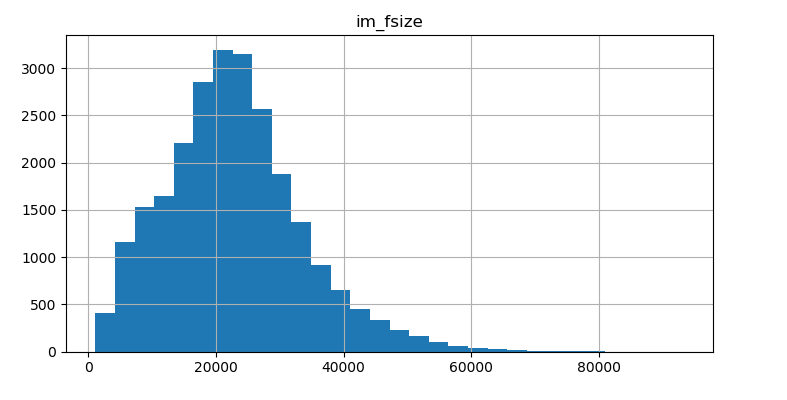

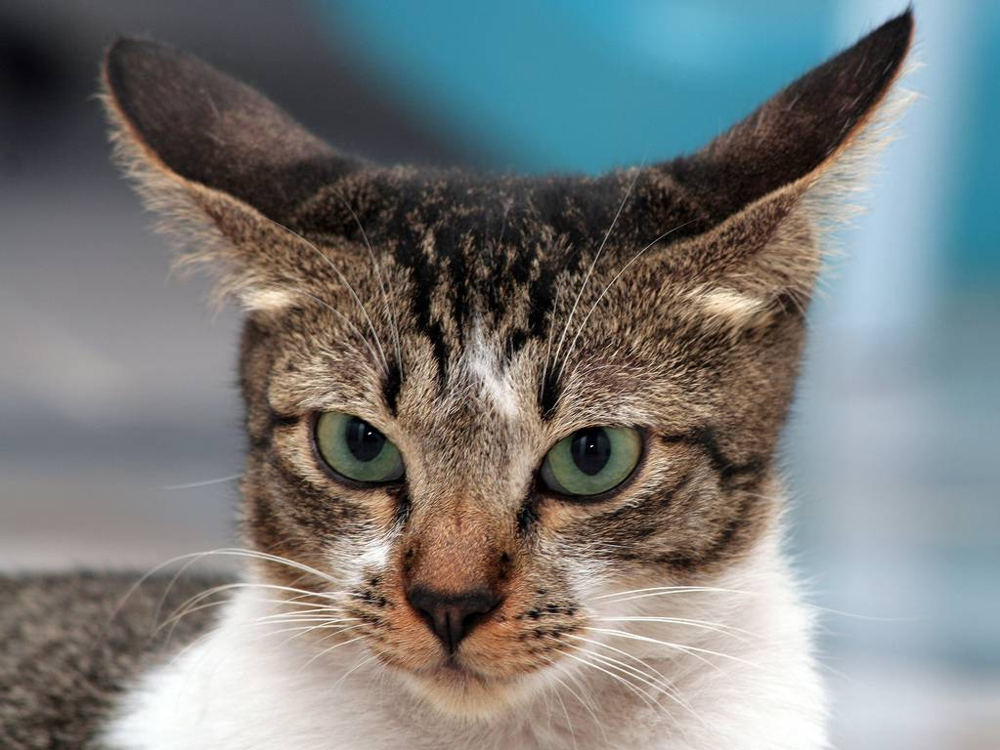cat.835.jpg

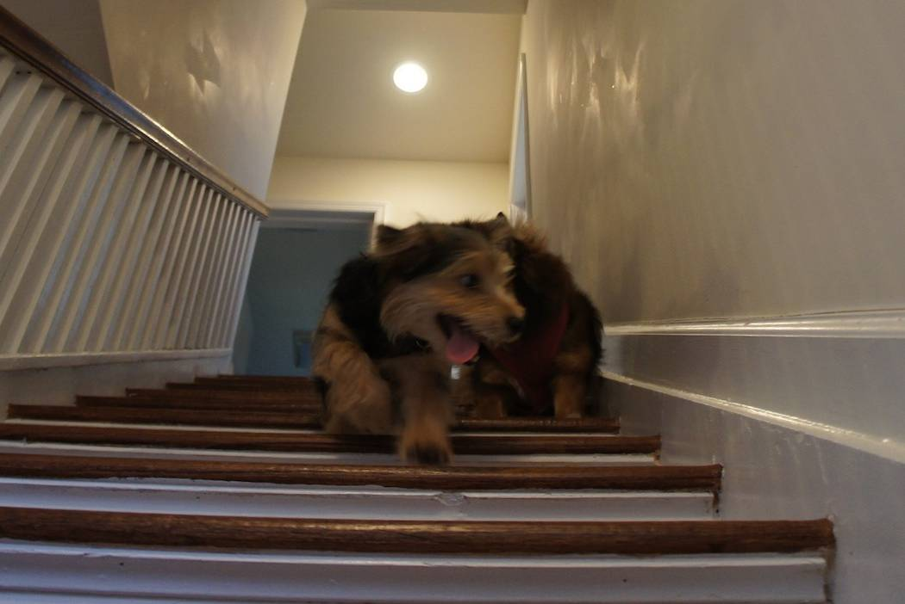dog.2317.jpg

对数据进行统计分析，发现图片的宽度集中在200px到500px左右，高度集中在200px到500px左右（猜测可能是因为有些图片是手机拍摄的），和大小分布在20KB左右（大小只的是文件大小）。

在宽度和高度的散点图发现有两个明显的离群点，找到原图cat.835.jpg和dog.2317.jpg，如上图所示，发现只是图片比较大而已，并没有什么异常。

图像的拍摄角度各异，但基本都是以猫或狗为主体，通过数据增强，如调整亮度、随机裁切、轻度旋转等处理，可进一步增大样本量，使模型有更多的数据样本进行训练，但在本次项目中并未利用数据增强，因为未采用数据增强的模型测试结果已经可以达到要求了。

图像的大小不同，尺寸都在（500，500）以内，但大小各异，送入模型进行学习前，需要做数据预处理，裁剪成为大小一致的图片，如采用不同的预训练模型时，其对图像的大小有不同的要求。InceptionV3要求图像数据大小为（299，299）；Vgg19及Resnet50的图像数据大小为（224，224）。

我选用的模型是VGG，因此需要裁剪图片尺寸为（224，224）。这部分工作可以使用pytorch提供的transforms.Compose来处理，把图片缩放成256 * 256，对准图片中心裁剪成224 * 224，然后用transforms.Normalize把图片标准化在（-1，1）之间。


### 算法和技术
猫狗大战这个项目本质上就是一个基于计算机图像识别技术的一个监督学习二分类问题。因此最好的解决方案就是采用非常成熟的深度神经网络技术中的卷积神经网络。

技术介绍：

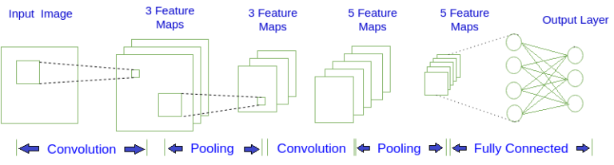
上面是一个简单的 CNN 结构图, 第一层输入图片, 进行卷积(Convolution)操作, 得到第二层深度为 3 的特征图(Feature Map). 对第二层的特征图进行池化(Pooling)操作, 得到第三层深度为 3 的特征图. 重复上述操作得到第五层深度为 5 的特征图, 最后将这 5 个特征图, 也就是 5 个矩阵, 按行展开连接成向量, 传入全连接(Fully Connected)层, 全连接层就是一个 BP 神经网络. 图中的每个特征图都可以看成是排列成矩阵形式的神经元, 与 BP神经网络中的神经元大同小异. 下面是卷积和池化的计算过程.

卷积：

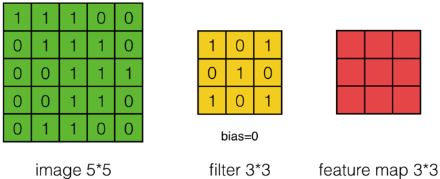


简单的说卷积可以理解为定义N个过滤器，来过滤图片中的特征。低级特征比如说可以是横线，竖线，斜线，中级特征是在低级特征上经过进一步卷积处理的特征，比如圆、正方形，更高级的特征则是在中级特征上经过进一步卷积处理的特征，比如说眼睛、耳朵等。这就是卷积的意义，可以提前与图片位置无关的特征信息。

池化：

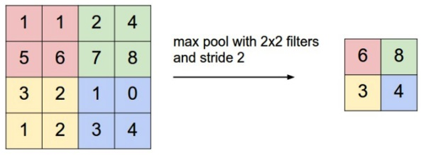
池化的意义比较简单，可以理解为将特征压缩，或者说将特征浓缩，这样减少计算量，大大加速训练过程。

全连接：

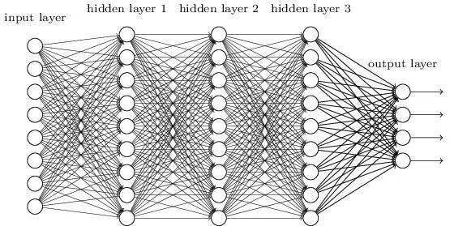

全连接就是一个深度神经网络，将提取的特征训练最终分类。

梯度下降和反向传播算法：

与 BP神经网络一样, CNN 也是通过梯度下降和反向传播算法进行训练的, 则全连接层的梯度公式与 BP网络完全一样, 这里就不重复了。

CNN 的特点：

一个 CNN 是为了识别二维形状而特殊设计的多层感知器, 对二维形状的缩放, 倾斜或其它形式的变形具有高度不变性. 每一个神经元从上一层的局部区域得到输入, 这迫使神经元提取局部特征. 一旦一个特征被提取出来, 它相对于其它特征的位置被近似保留下来, 而忽略掉精确的位置. 每个卷积层后面跟着一个池化, 使得特征图的分辨率降低, 而有利于降低对二维图形的平移或其他形式的敏感度。

权值共享是 CNN 的一大特点, 每一个卷积核滑遍整个输入矩阵, 而参数的数目等于卷积核矩阵元素的数目加上一个偏置, 相对于 BP 网络大大减少了训练的参数. 例如对于一张 300×300300×300 的彩色图片, 如果第一层网络有25个神经元, 使用 BP网络, 参数的数目可达 675万个(300×300×3×25+1300×300×3×25+1), 而卷积网络只有76个(25×3+125×3+1)。

每一个卷积核就是一个特征提取器, 可以提取出输入图片或特征图中形状, 颜色等特征. 当卷积核滑动到具有这种特征的位置时, 便会产生较大的输出值, 从而达到激活的状态。

### 基准模型

我们期望训练后的模型在测试集上的得分表现 score 可以达到 kaggle 排行榜前 10%，即是在 Public Leaderboard 上的 logloss 低于 0.06127


## III. 方法
### 数据预处理

1. 异常值检测，在用图片可视化环节看到高度和宽度明显离散的图片，查看本地数据集为cat.835.jpg和dog.2317.jpg，这两者图片只是比较大而已，没有存在分类错误的问题，因此不需要排除。

   train文件夹下面一共有25000张图片，这些图片如果手动一张一张的来找异常图片显然是不太可能的。因此这里用keras的Resnet50模型上进行预测，如果其预测结果top50不包含猫狗真实的标签分类（图片预测值前50都没有正常分类），那么就将其视为异常值。

   将剔除的图片放到outlier文件夹下面，可以看到被剔除的图片大部分都是有问题的图片，如果这些图片参入训练会对训练造成非常大的干扰。

   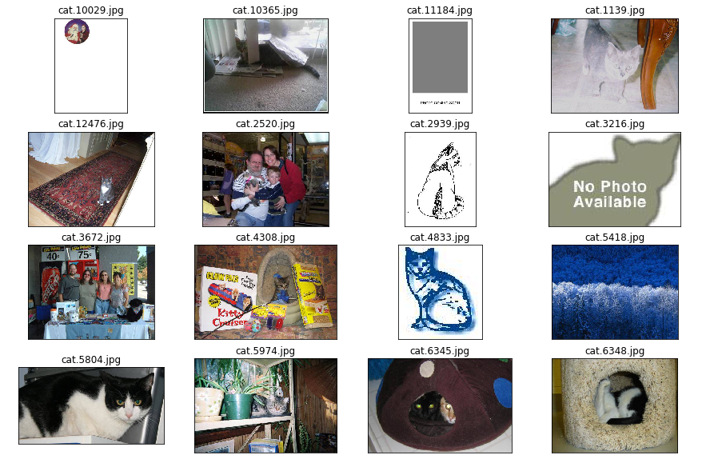

2. 项目采用的框架选择为pytorch，为了能够使用pytorch正确的加载图片。就要把数据集中的图片，处理成pytorch能够识别的文件结构

   ```python
   images
   --train
   ----cat
   ----dog
   --valid
   ----cat
   ----dog
   ```

3. 然后就是数据归一化，使用pytorch提供的transforms将训练集和验证集的图片做归一化处理。缩放成256 * 256，裁剪成224 * 224，训练集还要对图片随机翻转，中心化，最后把彩色图片的RGB值处理在（-1，1）之间，代码如下：

   ```python
   train_transforms = transforms.Compose([transforms.Resize(256),
                                          transforms.CenterCrop(224),
                                          transforms.RandomRotation(30),
                                          transforms.RandomResizedCrop(224),
                                          transforms.RandomHorizontalFlip(),
                                          transforms.ToTensor(),
                                          transforms.Normalize(mean=mean,std=std)])
   ```

   

### 执行过程
1. 模型构建：

   可以自定义一个全连接的深度神经网络，或者用机器学习框架提供的方法去下载一个已经预训练的模型。这里我选择使用pytourch框架下载预训练的vgg16模型。

   vgg16是一个卷积神经网络，卷积神经网络最初是为解决图像识别等问题而设计的，当前不仅应用于图像和视频，也可用于时间序列信号。在卷积神经网络中，第一个卷积层会直接接受图像像素级的输入，每一个卷积操作只处理一小块图像，进行卷积变化后再传到后面的网络,卷积层可以提前特征。后面就是池化层，简单的说池化层的目的就是把特征压缩，提前特征的关键部分，这样可以减少计算量大大提高训练速度。卷积层和池化层中间可能会有激活函数等。经过若干个卷积层+池化层的迭代最终可以提取到图片的高级特征，然后用若干个全连接层接受高级特征，最后完成分类。下面就是vgg16的结构。

   ```python
   VGG(
     (features): Sequential(
       (0): Conv2d(3, 64, kernel_size=(3, 3), stride=(1, 1), padding=(1, 1))
       (1): ReLU(inplace=True)
       (2): Conv2d(64, 64, kernel_size=(3, 3), stride=(1, 1), padding=(1, 1))
       (3): ReLU(inplace=True)
       (4): MaxPool2d(kernel_size=2, stride=2, padding=0, dilation=1, ceil_mode=False)
       (5): Conv2d(64, 128, kernel_size=(3, 3), stride=(1, 1), padding=(1, 1))
       (6): ReLU(inplace=True)
       (7): Conv2d(128, 128, kernel_size=(3, 3), stride=(1, 1), padding=(1, 1))
       (8): ReLU(inplace=True)
       (9): MaxPool2d(kernel_size=2, stride=2, padding=0, dilation=1, ceil_mode=False)
       (10): Conv2d(128, 256, kernel_size=(3, 3), stride=(1, 1), padding=(1, 1))
       (11): ReLU(inplace=True)
       (12): Conv2d(256, 256, kernel_size=(3, 3), stride=(1, 1), padding=(1, 1))
       (13): ReLU(inplace=True)
       (14): Conv2d(256, 256, kernel_size=(3, 3), stride=(1, 1), padding=(1, 1))
       (15): ReLU(inplace=True)
       (16): MaxPool2d(kernel_size=2, stride=2, padding=0, dilation=1, ceil_mode=False)
       (17): Conv2d(256, 512, kernel_size=(3, 3), stride=(1, 1), padding=(1, 1))
       (18): ReLU(inplace=True)
       (19): Conv2d(512, 512, kernel_size=(3, 3), stride=(1, 1), padding=(1, 1))
       (20): ReLU(inplace=True)
       (21): Conv2d(512, 512, kernel_size=(3, 3), stride=(1, 1), padding=(1, 1))
       (22): ReLU(inplace=True)
       (23): MaxPool2d(kernel_size=2, stride=2, padding=0, dilation=1, ceil_mode=False)
       (24): Conv2d(512, 512, kernel_size=(3, 3), stride=(1, 1), padding=(1, 1))
       (25): ReLU(inplace=True)
       (26): Conv2d(512, 512, kernel_size=(3, 3), stride=(1, 1), padding=(1, 1))
       (27): ReLU(inplace=True)
       (28): Conv2d(512, 512, kernel_size=(3, 3), stride=(1, 1), padding=(1, 1))
       (29): ReLU(inplace=True)
       (30): MaxPool2d(kernel_size=2, stride=2, padding=0, dilation=1, ceil_mode=False)
     )
     (avgpool): AdaptiveAvgPool2d(output_size=(7, 7))
     (classifier): Sequential(
       (0): Linear(in_features=25088, out_features=4096, bias=True)
       (1): ReLU(inplace=True)
       (2): Dropout(p=0.5, inplace=False)
       (3): Linear(in_features=4096, out_features=4096, bias=True)
       (4): ReLU(inplace=True)
       (5): Dropout(p=0.5, inplace=False)
       (6): Linear(in_features=4096, out_features=1000, bias=True)
     )
   )
   ```

2. 迁移学习：

   下载好的模型有特征和分类器，特征部分可以复用，但是分类器部分就不一定适用猫狗分类项目了，因此这里需要把分类器替换成自己的分类器。分类器其实就是一个深度神经网络的全连接层，vgg分类器的第一层input是输入图片归一化后的张量，隐藏层为两个4096节点的网络层，因为是猫狗分类，分类结果只有两个，输出层就是一个2节点的网络层。激活使用ReLU，使用概率为0.5的Dropout技术，让每个节点都尽量得到训练，这样可以缓解过拟合的发生。这里只需要替换分类器最后一层即可，代码如下。当然也可以自己选择增加一些隐藏层，让模型变得复杂，增加全连接层的深度可以让模型有更大的容量，因此可以提高模型的精准度，代价就是需要更多的时间来训练。

   ```python
   model.classifier[6] = torch.nn.Linear(4096, 2)
   ```

3. 优化器：

​       优化器用来更新和计算模型参数，使其更加逼近或者达到最优值，从而使loss 损失函数最小。 神经网络中最     常用优化算法是梯度下降，其核心是：对于每一个变量，按照目标函数在该变量的梯度下降的方向（梯度的反方向）进行更新，学习率决定了每次更新的步长。即在超平面上目标函数沿着斜率下降的方向前进，直到到达超平面的谷底。

lr：学习率，相当于梯度下降的时候，每一步的大小，步子太大可能会跨越过最低点，步子太小则意味着需要更多步才能找到最低点。配合使用lr衰减，在两者之间平衡，先大步的走，能保证训练速度不会太慢，在接近目标后减小步子，防止错过最低点。

weight_decay：权重衰减，L2正则化的目的就是为了让权重衰减到更小的值，在一定程度上减少模型过拟合的问题，所以权重衰减也叫L2正则化。

4.训练和验证：

epochs选择20，lr选择0.001，weight_decay选择0.1，优化器选择opt_SGD。每epoch把train_loss,valid_loss,train_acc,valid_acc都记录下来并打印出来观察，完成全部轮数后。将train_loss,valid_loss,train_acc,valid_acc通过matplotlib.pyplot可视化，这样可以清晰的观察每epoch发生的变化，来为之后的调整做决策。

```
Epoch: 1/20  Train Total: 19971 Train Loss: 0.2005 Train Acc: 0.9099 Valid Total: 4986 Valid Loss: 0.0448 Valid Acc: 0.9824
Epoch: 2/20  Train Total: 19971 Train Loss: 0.1940 Train Acc: 0.9133 Valid Total: 4986 Valid Loss: 0.0498 Valid Acc: 0.9795
Epoch: 3/20  Train Total: 19971 Train Loss: 0.1765 Train Acc: 0.9213 Valid Total: 4986 Valid Loss: 0.0399 Valid Acc: 0.9846
Epoch: 4/20  Train Total: 19971 Train Loss: 0.1781 Train Acc: 0.9208 Valid Total: 4986 Valid Loss: 0.0407 Valid Acc: 0.9836
Epoch: 5/20  Train Total: 19971 Train Loss: 0.1754 Train Acc: 0.9228 Valid Total: 4986 Valid Loss: 0.0395 Valid Acc: 0.9844
Epoch: 6/20  Train Total: 19971 Train Loss: 0.1697 Train Acc: 0.9269 Valid Total: 4986 Valid Loss: 0.0402 Valid Acc: 0.9842
Epoch: 7/20  Train Total: 19971 Train Loss: 0.1701 Train Acc: 0.9268 Valid Total: 4986 Valid Loss: 0.0400 Valid Acc: 0.9844
Epoch: 8/20  Train Total: 19971 Train Loss: 0.1737 Train Acc: 0.9238 Valid Total: 4986 Valid Loss: 0.0395 Valid Acc: 0.9848
Epoch: 9/20  Train Total: 19971 Train Loss: 0.1725 Train Acc: 0.9249 Valid Total: 4986 Valid Loss: 0.0395 Valid Acc: 0.9848
Epoch: 10/20  Train Total: 19971 Train Loss: 0.1695 Train Acc: 0.9251 Valid Total: 4986 Valid Loss: 0.0396 Valid Acc: 0.9846
Epoch: 11/20  Train Total: 19971 Train Loss: 0.1701 Train Acc: 0.9246 Valid Total: 4986 Valid Loss: 0.0396 Valid Acc: 0.9846
Epoch: 12/20  Train Total: 19971 Train Loss: 0.1693 Train Acc: 0.9268 Valid Total: 4986 Valid Loss: 0.0397 Valid Acc: 0.9846
Epoch: 13/20  Train Total: 19971 Train Loss: 0.1721 Train Acc: 0.9253 Valid Total: 4986 Valid Loss: 0.0397 Valid Acc: 0.9846
Epoch: 14/20  Train Total: 19971 Train Loss: 0.1742 Train Acc: 0.9245 Valid Total: 4986 Valid Loss: 0.0397 Valid Acc: 0.9846
Epoch: 15/20  Train Total: 19971 Train Loss: 0.1680 Train Acc: 0.9275 Valid Total: 4986 Valid Loss: 0.0397 Valid Acc: 0.9846
Epoch: 16/20  Train Total: 19971 Train Loss: 0.1733 Train Acc: 0.9255 Valid Total: 4986 Valid Loss: 0.0397 Valid Acc: 0.9846
Epoch: 17/20  Train Total: 19971 Train Loss: 0.1717 Train Acc: 0.9266 Valid Total: 4986 Valid Loss: 0.0397 Valid Acc: 0.9846
Epoch: 18/20  Train Total: 19971 Train Loss: 0.1678 Train Acc: 0.9295 Valid Total: 4986 Valid Loss: 0.0397 Valid Acc: 0.9846
Epoch: 19/20  Train Total: 19971 Train Loss: 0.1693 Train Acc: 0.9261 Valid Total: 4986 Valid Loss: 0.0397 Valid Acc: 0.9846
Epoch: 20/20  Train Total: 19971 Train Loss: 0.1760 Train Acc: 0.9235 Valid Total: 4986 Valid Loss: 0.0397 Valid Acc: 0.9846
```

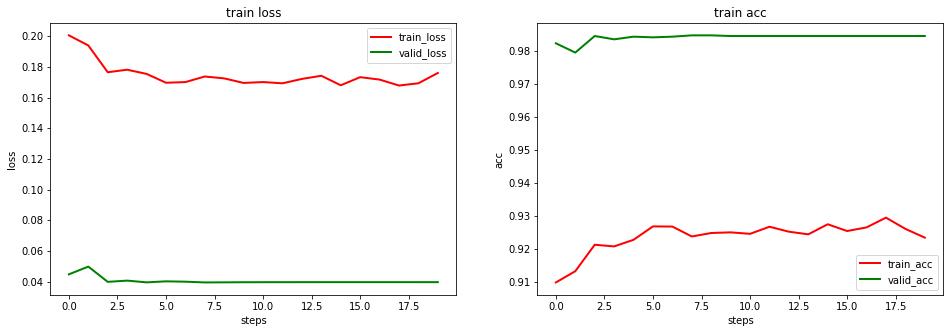

对比寻找最优的参数组合：

1. 实验完毕，考虑到有优化的空间，因此采用对比的方式，来找到更好的结果。使用四个不同的优化器opt_SGD、opt_Momentum、opt_RMSprop、opt_Adam对同一个模型来优化，记录训练loss，验证loss，训练准确率和验证准确率。
2. 使用四个不同的模型vgg16、vgg19、resnet50、alexnet，交叉使用四个不同的优化器，并且使用学习率衰减的方式来训练模型，记录训练loss，验证loss，训练准确率和验证准确率。
3. 将4个模型和4中优化器结合训练记录的训练loss，验证loss，训练准确率和验证准确率的数据做分析，可以得到下面这个表格。

| 模型名称 | 优化器       | epoch | 最小valid_loss |
| -------- | ------------ | ----- | -------------- |
| vgg16    | opt_SGD      | 8     | 0.0492         |
| vgg16    | opt_Momentum | 3     | 0.0407         |
| vgg16    | opt_RMSprop  | 6     | 0.0394         |
| vgg16    | opt_Adam     | 4     | 0.0395         |
| vgg19    | opt_SGD      | 16    | 0.046501       |
| vgg19    | opt_Momentum | 5     | 0.037046       |
| vgg19    | opt_RMSprop  | 4     | 0.035506       |
| vgg19    | opt_Adam     | 3     | 0.035761       |
| resnet50 | opt_SGD      | 10    | 0.102495       |
| resnet50 | opt_Momentum | 9     | 0.073628       |
| resnet50 | opt_RMSprop  | 13    | 0.067456       |
| resnet50 | opt_Adam     | 17    | 0.068216       |
| alexnet  | opt_SGD      | 20    | 0.104827       |
| alexnet  | opt_Momentum | 4     | 0.090908       |
| alexnet  | opt_RMSprop  | 4     | 0.092492       |
| alexnet  | opt_Adam     | 5     | 0.088060       |

通过观察可知四个模型中vgg19表现最好，在vgg19中，优化器opt_Momentum表现最好，因此选择这个模型。


模型在验证集上的logloss为0.0351，验证集准确率为0.9874，如下图所示

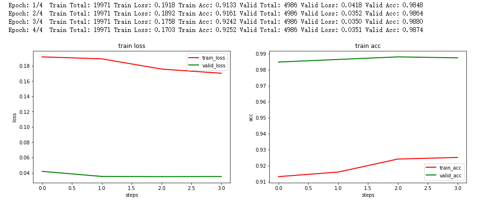

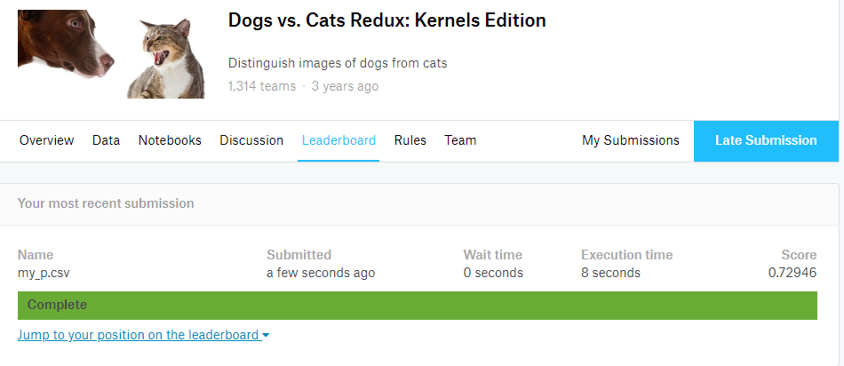

kaggle提交情况，score为0.72946，未达到要求。

### 完善

经过反复考虑，分析出失败肯定不止一种原因。因此需要从头到尾再来一遍。为此重新制定下列方案。


- 更换框架，原因1需要排除框架的影响，原因2多尝试新的框架会开拓自己的视野，原因3pytourch总是在执行过程中出现现存不够的情况，让人很崩溃。基于以上原因选择了使用tensorflow。

- 重新清洗数据（图片），之前的操作流程是先识别出猫和狗的图片，然后再把猫和狗的图片分类到不同的文件夹中。仔细思考了一下，这样做肯定能分离出既不是猫也不是狗的图片，但是这里可能会导致两个问题无法被识别：问题1猫和狗的元素混合在一张图片里，问题2比如说猫的图片标注却是狗。因此这次更换了思路，首先按照标注把猫和狗分别放在不同的文件夹里面，然后使用resnet50去猫的文件夹里面剔除掉不是猫的，去狗的文件夹里面剔除不是狗的（细节可以查看clean_image.ipynb）。果然发现了一些有意思的图片，其中cat.7920.jpg虽说是猫狗混合，但其实很难分辨出猫的特征，把他标注成猫对模型的训练有很大的影响，cat.5355.jpg则是典型的猫狗混合，这样图片必须被剔除。

  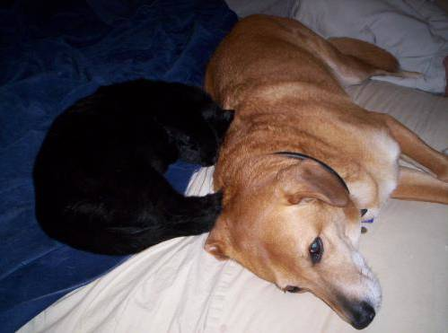cat.7920.jpg（猫狗混合）

  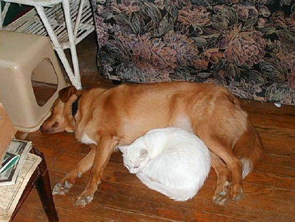cat.5355.jpg（猫狗混合）

- 使用更先进的深度学习网络InceptionV3，更复杂的学习模型可以学习到更多的特性，能更精确的预测。

```python
base_model = InceptionV3(weights='imagenet', include_top=False, input_shape=(299, 299, 3))
base_model.summary()
```

- 增加全连接分类层的深度

```python
my_model = models.Sequential()
my_model.add(base_model)
my_model.add(layers.Flatten())
my_model.add(layers.Dense(1024, activation='relu'))
my_model.add(layers.Dropout(0.5))
my_model.add(layers.Dense(128, activation='relu'))
my_model.add(layers.Dropout(0.5))
my_model.add(layers.Dense(1, activation='sigmoid'))

```

- 使用keras提供的lr衰减

  ```python
  # LR衰减,如果在patience个epoch中看不到模型性能提升，则减少学习率
  reduce_lr = ReduceLROnPlateau(monitor=monitor, factor=0.1, patience=3, verbose=1)
  ```

- 使用early stopping，这样可以节省训练的时间，提升效率

  ```python
  # 早停法，如果20轮val_loss还不下降就结束
  early_stopping = EarlyStopping(monitor=monitor, patience=20, verbose=1)
  ```

- 使用keras提供的保存最优checkpoint

  ```python
  # 保存最优模型
  checkpoint = ModelCheckpoint(model_path, monitor=monitor, save_best_only=True, verbose=1)
  ```


## IV. 结果
### 模型的评价与验证
- 验证集上的logloss

在验证集上logloss达到0.0263，准曲率为0.9931。

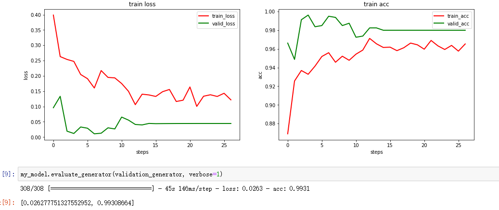


- kaggle上的score

score为0.5505低于0.06127，达到了要求。

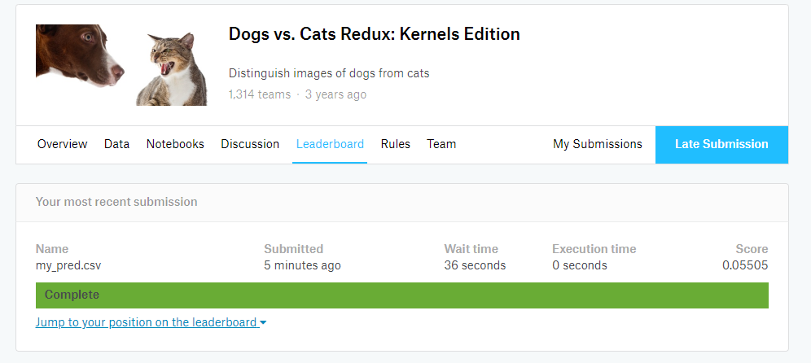

- kaggle上的排名

排名在94的位置上，94/1314=7%，在前top10%，达到要求。

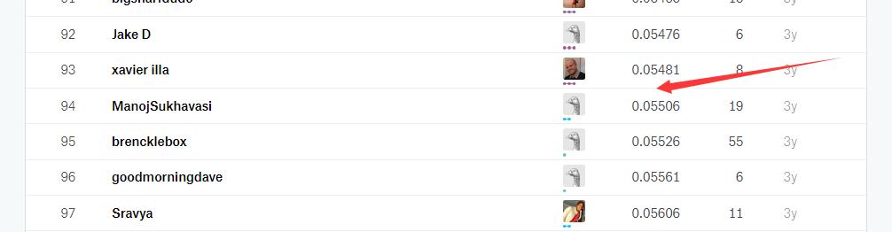


## V. 项目结论

### 对项目的思考
猫狗大战是一个非常有挑战的项目，我花了一个多月的时间才将他搞定。整个过程就是一开始信心满满到后来的不断失败，不断调整。任何机器学习问题，都免不了数据预处理、模型构建、模型训练、测试与验证等步骤；但预处理与模型调参可能会占用大部分时间和精力，数据组织方式也会对模型有较大影响。每个环节都需要认认真真的完成才能保证有好的结果。


### 需要作出的改进

- 由于时间仓促，以及计算资源的限制。所以将vgg16，vgg19，InceptionV3等这些模型的参数都冻结了，只训练了自己的全连接分类层，如果有更多的现存，将迁移学习的模型参数不冻结一起训练，效果可能会更好
- 数据处理的地方，其实还有更多的方法可以做，比如调整topn的值，更合适更合理的剔除异常的图片。还有lr，lr衰减等参数也继续微调。
- 我这里用到了google的tensorflow，google还有另外一个框架NSL(Neural Structured Learning)，它能应对数据匮乏，提高模型精度，简化编程工作等

总之模型还有可以优化的地方。


## 文件说明

**dog_vs_cat.ipynb** 是以pytorch技术来实现的，最终没能达到预期的效果

**clean_image.ipynb**是优化后的清洗数据方案和过程

**dog_vs_cat_InceptionV3.ipynb** 是最终解决方案和过程，完成了目标。


### 参考文献

> Simonyan K, Zisserman A. Very Deep Convolutional Networks for Large-Scale Image Recognition[J]. Computer Science, 2014.
>
>  翟永杰，韩璞，王东风，王国鹏.    基于损失函数的SVM算法及其在轻微故障诊断中的应用《 中国电机工程学报 》 ， 2003


